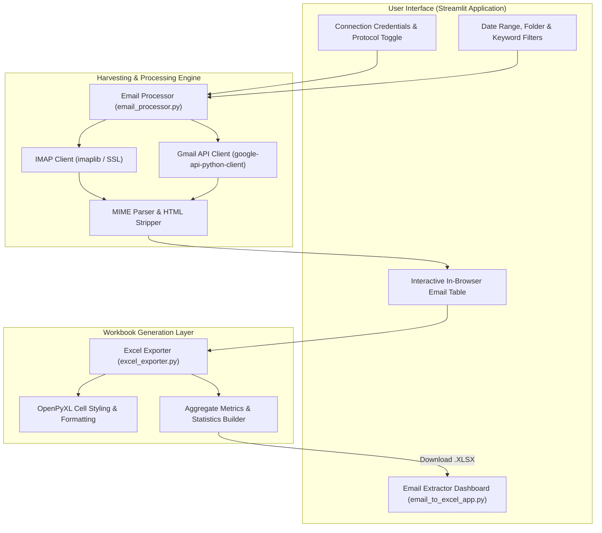

<br/><br/>

<!-- Animated Title -->
<p align="center">
  <a href="#">
    
  </a>
</p>

<p align="center">
  <b>Enterprise Email Intelligence, Inbox Harvesting & Automated Excel Reporting Agent</b><br/>
  <i>Dual Protocol Engine (IMAP & Gmail API) · Automated Field Parsing & Attachment Auditing · Styled Excel Workbook Generation · Interactive Streamlit Operational Studio</i>
</p>

<br/>

<!-- Badges Row 1: Core Technologies -->
<p align="center">
  
  
  
  
  
</p>

<!-- Badges Row 2: Security & Status -->
<p align="center">
  
  
  
  
</p>

<br/>

<!-- Quick Navigation Bar -->
<p align="center">
  <a href="#-overview"></a>
  &nbsp;
  <a href="#-problem-statement--automation-solution"></a>
  &nbsp;
  <a href="#-core-capabilities"></a>
  &nbsp;
  <a href="#%EF%B8%8F-system-architecture"></a>
  &nbsp;
  <a href="#-protocol-integration-matrix"></a>
  &nbsp;
  <a href="#-quickstart--execution"></a>
</p>

---

## 📌 Overview

**Email to Excel Converter & Intelligence Agent** is an automated document harvesting platform engineered to bridge communication channels with structured operational databases. By connecting directly to enterprise mail servers via **IMAP** (Gmail, Microsoft Outlook, Office 365, Yahoo, corporate servers) or **Google Cloud Gmail API**, the agent systematically extracts, normalizes, filters, and formats communications into executive-ready Excel spreadsheets.

Built with a modular Python architecture and deployed as an interactive **Streamlit Studio**, the platform turns unstructured inbox clutter into organized tabular records with automatic header styling, attachment auditing, chronological filtering, and statistical summaries.

```
                      ┌────────────────────────────────────────────────────────┐
                      │              Email Harvesting Agent                    │
                      │                                                        │
[ Inboxes: Gmail /   ]┼──> [ Secure Auth: TLS IMAP / OAuth2 ]                  ├──> [ Styled Excel Workbook ]
[ Outlook / Corporate]│             │                                          │    - Clean Chronological Ledger
                      │             ▼                                          │    - Formatted Headers & Styles
                      │    [ Message Parser & Sanitizer ]                      │    - Attachment Audit Metadata
                      │       ├── Date Normalization & Read Status             │    - Volume & Sender Metrics
                      │       └── HTML / Multipart Body Extraction             │    - Multi-Sheet Statistics
                      │             │                                          │
                      │             ▼                                          │
                      │    [ Excel Exporter Engine (OpenPyXL / Pandas) ]       │
                      └────────────────────────────────────────────────────────┘
```

---

## 🎯 Problem Statement & Automation Solution

<table>
<tr>
<td width="50%" valign="top">

### ❌ The Manual Email Triage Burden

Corporate teams waste hundreds of hours manually processing email data:

- 📋 **Manual Copy-Pasting**: Customer support, finance, and logistics personnel manually transcribe email receipts and inquiry tickets into spreadsheets.
- 📎 **Lost Attachment Audits**: Difficulty tracking which clients included purchase orders, invoices, or identity verification PDFs.
- 🔐 **Security Fragility**: Storing raw passwords in plaintext scripts exposes accounts to credential compromise.
- 📉 **Formatting Inconsistencies**: Ad-hoc CSV dumps lack column widths, date serialization, and readable text wrapping.

</td>
<td width="50%" valign="top">

### ✅ The Automated Agent Solution

| Challenge | Applied Engineering Solution |
| :--- | :--- |
| **Zero-Manual Triage** | Automated background extraction of hundreds of emails into structured columns in seconds. |
| **Dual Connection Standards** | Supports universal **IMAP with App Passwords** alongside **Google Cloud Gmail API (OAuth2)**. |
| **Intelligent Filtering** | Query by date window, folder (`INBOX`, `Sent`, `Archive`), read status, and sender keywords. |
| **Publication-Ready Styling** | Generates styled **`.xlsx` files** with formatted table headers, auto-adjusted column widths, and summary tabs. |

</td>
</tr>
</table>

---

## 🔥 Core Capabilities

<table>
<tr>
<td width="33%" align="center" valign="top">

### 🌐 Universal Mail Sync
<br/>
<b>Dual Protocol Connectors</b>
<p align="left">
• Universal SSL/TLS IMAP support<br/>
• Google Cloud Gmail API (OAuth2)<br/>
• Gmail, Outlook, Office 365, Yahoo<br/>
• App Password compatibility<br/>
• Automatic mailbox folder discovery
</p>

</td>
<td width="33%" align="center" valign="top">

### 🧹 Smart Extraction
<br/>
<b>Message Sanitization</b>
<p align="left">
• Sender name & email parsing<br/>
• Chronological date normalization<br/>
• Multipart MIME body extraction<br/>
• Attachment counting & file tagging<br/>
• Read vs Unread message flags
</p>

</td>
<td width="33%" align="center" valign="top">

### 📊 Formatted Excel
<br/>
<b>Executive Reporting</b>
<p align="left">
• OpenPyXL multi-sheet workbooks<br/>
• Formatted corporate header bands<br/>
• Automatic column width fitting<br/>
• Cumulative statistics sheet<br/>
• Instant CSV fallback download
</p>

</td>
</tr>
</table>

---

## 🏗️ System Architecture



---

## 🔬 Protocol Integration Matrix

The platform supports two distinct integration modalities:

| Feature | Option 1: Universal IMAP (Recommended) | Option 2: Google Gmail API |
| :--- | :--- | :--- |
| **Supported Providers** | Gmail, Outlook, Office 365, Yahoo, Custom | Google Workspace & Personal Gmail |
| **Authentication** | SSL/TLS with App Password | OAuth2 Client Credentials (`credentials.json`) |
| **Setup Complexity** | Zero cloud setup; instant connection in $<1$ minute | Requires Google Cloud Project & API enablement |
| **Performance** | Fast sequential header & body fetching | Optimized batch API request quotas |

---

## ⚙️ Technical Stack

| Component | Technology | Purpose & Implementation |
| :--- | :--- | :--- |
| **Language** | **Python 3.10+** | Core asynchronous logic and data pipelines |
| **Web Studio** | **Streamlit** | Interactive UI with real-time progress bars and credential masking |
| **Email Protocols** | **imaplib, email, google-api-python-client** | Low-level RFC-compliant mail handling and Google API endpoints |
| **Workbook Formatting** | **OpenPyXL & XlsxWriter** | Custom cell styling, column width auto-calculation, and freeze panes |
| **Data Structures** | **Pandas** | Tabular transformation, date filtering, and CSV serialization |

---

## 📁 Repository Structure

```
chatbot/
├── 📄 email_to_excel_app.py           # Main interactive Streamlit application
├── 📄 streamlit_app.py                # Alternate conversational UI entry point
├── 📄 email_processor.py              # IMAP and Gmail API ingestion & parsing engine
├── 📄 excel_exporter.py               # Styled Excel workbook builder and formatter
├── 📄 example_usage.py                # Programmatic CLI usage demonstration
├── 📄 test_email_agent.py             # Automated unit and integration test suite
├── 📄 verify_structure.py             # Pre-flight environment and dependency checker
├── 📄 requirements.txt                # Runtime dependencies
├── 📄 README_EMAIL_TO_EXCEL.md        # Technical user guide
└── 📄 README.md                       # Comprehensive documentation
```

---

## 🚀 Quickstart & Execution

### Prerequisites
- **Python**: 3.10 or higher
- **Email Credentials**: App Password (for Gmail/Outlook) or standard IMAP credentials

---

### 1. Installation

```bash
# 1. Clone repository
git clone https://github.com/IbrahimAbdelsattar/chatbot.git
cd chatbot

# 2. Create virtual environment
python -m venv venv
source venv/bin/activate        # On Windows: .\venv\Scripts\activate

# 3. Install dependencies
pip install -r requirements.txt
```

---

### 2. Launching the Application

```bash
streamlit run email_to_excel_app.py
```

*The interface will automatically open in your default browser at `http://localhost:8501`. Enter your IMAP credentials, select your target date window, preview extracted emails, and download your formatted Excel workbook.*

---

## 👥 Author & Connect

**Ibrahim Abdelsattar**  
*AI Engineer & Machine Learning Specialist*

- 🌐 **GitHub**: [@IbrahimAbdelsattar](https://github.com/IbrahimAbdelsattar)
- 💼 **LinkedIn**: [Ibrahim Abdelsattar](https://www.linkedin.com/in/ibrahim-abdelsattar/)
- 📧 **Email**: [ibrahimabdelsattar042@gmail.com](mailto:ibrahimabdelsattar042@gmail.com)

---

<p align="center">
  <sub>Engineered for email intelligence, workflow automation, and enterprise reporting. © 2026 Email Intelligence Agent.</sub>
</p>
